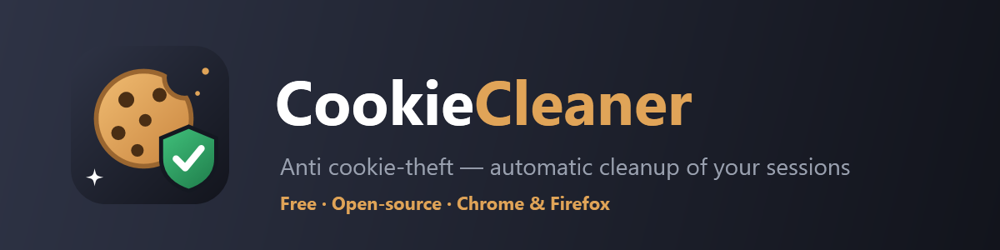

<div align="center">



[🇫🇷 Version française](README.md) · **🇬🇧 English** · [🌐 Website](https://frankkdarko.github.io/CookieCleaner/)

**Limit the impact of cookie theft. Automatically.**

Clears cookies and session data of the sites you choose, at regular intervals —
so a cookie stolen by malware becomes useless within hours instead of weeks.

[](LICENSE)


**Chrome** · **Edge** · **Brave** · **Opera** · **Firefox**

</div>

---

## 🎯 Why?

*Infostealer* malware (RedLine, Lumma, Raccoon…) steals your browser cookies and lets an attacker **log into your accounts without a password — and without triggering 2FA**, since the session is already authenticated. Discord, Gmail, Steam, social networks: everything is exposed.

A stolen cookie is only useful **while the session is valid**. CookieCleaner regularly purges the cookies (and the `localStorage` tokens, which covers the Discord case) of the sensitive sites you choose. Result: the exploitation window of a theft drops from several weeks to a few hours.

> ⚠️ **Let's be honest**: CookieCleaner **reduces** the risk, it does not eliminate it. If malware is active on your machine, it can steal your cookies again the next time you log in. This tool complements a clean system, an antivirus and 2FA — it does not replace them. If you are actually infected: clean the machine, change your passwords **from another device**, and revoke all sessions.

## ✨ Features

- 🧹 **Automatic cleanup** of cookies every 30 min to 24 h (or at browser startup)
- 🎯 **Two modes**: a list of chosen sites, or "clean everything except my whitelist"
- ⚡ **One-click presets**: Discord, Google, Steam, PayPal, Microsoft, social networks…
- 🔐 **`localStorage` / IndexedDB purge** — where Discord-style tokens live, which classic cookie cleaners forget
- 🔗 **Revocation links**: direct access to the official "connected devices" pages to kill sessions server-side
- 🕵️ **Breach check**: email via [Have I Been Pwned](https://haveibeenpwned.com), password via the anonymous *Pwned Passwords* API (k-anonymity — the password never leaves your device)
- 📋 **Cleanup log**
- 🌍 5 languages (Français, English, Español, Deutsch, Italiano) — follows the browser automatically, or manual choice in settings
- 🆓 **Free forever, open-source, zero server, zero telemetry** — everything stays on your machine

## 📦 Installation

### Chrome / Edge / Brave / Opera

*While waiting for the Chrome Web Store release:*

1. Download the `chromium` ZIP from the [Releases](../../releases) (or clone this repo)
2. Unzip it
3. Open `chrome://extensions` (or `edge://extensions`, `opera://extensions`)
4. Enable **Developer mode** (top right)
5. Click **"Load unpacked"** and select the `extension/` folder

### Firefox

Firefox requires extensions signed by Mozilla. Download the signed `.xpi` file from the [Releases](../../releases) and open it with Firefox — that's it.

> ℹ️ On Firefox, remember to grant the "Access your data for all websites" permission in the extension settings, otherwise the cleanup won't see all cookies.

## 🚀 Usage

1. Click the 🍪 icon then **⚙️ Settings**
2. Add your sensitive sites (or use the presets)
3. Choose the cleanup frequency
4. That's it — the **"Clean now"** button in the popup is there for immediate cleanups

> 💡 Each cleanup **logs you out** of the affected sites: that's the point. Pick a frequency that fits your usage (6 h is a good compromise).

## ❓ FAQ

**Why does the extension page address look like `chrome-extension://cjfljdkma…/options.html`?**
That's how *all* extensions work: the browser assigns each one a unique identifier (that string of letters) and serves its pages through the `chrome-extension://` protocol (or `moz-extension://` on Firefox). It is not a web address — nothing goes through the internet, the page is loaded from your disk. In developer mode the identifier changes from one machine to another; once the extension is published on the stores, it becomes fixed and identical for everyone.

## 🔒 Privacy

- **No data leaves your device.** No server, no account, no statistics.
- The only outgoing network requests are the ones **you** trigger in the "breaches" section (to haveibeenpwned.com / api.pwnedpasswords.com).
- The password check uses k-anonymity: only the first 5 characters of the SHA-1 hash are sent.
- The code is deliberately **dependency-free and build-free**: everything is readable and auditable in [`extension/`](extension/).

## 🛠️ Development

```
extension/
├── manifest.json       # MV3, Chromium + Firefox compatible
├── background.js       # Service worker: alarms + cleanup logic
├── popup/              # Popup (status, immediate cleanup)
├── options/            # Full configuration
├── common/             # Shared style + i18n
└── _locales/           # fr, en, es, de, it
```

Build the distribution ZIPs:

```powershell
powershell -File scripts/build.ps1
```

## 🗺️ Roadmap

- [x] Periodic cleanup by site list / everything-except-whitelist
- [x] localStorage + IndexedDB purge
- [x] Breach check (HIBP)
- [ ] Chrome Web Store + addons.mozilla.org release
- [ ] Discreet notification after cleanup (opt-in)
- [ ] Hygiene score (third-party cookies, old sessions…)
- [ ] "What to do if I'm infected?" guide

Contributions are welcome — open an issue or a PR!

## 📄 License

[MIT](LICENSE) — use, modify, share freely.
