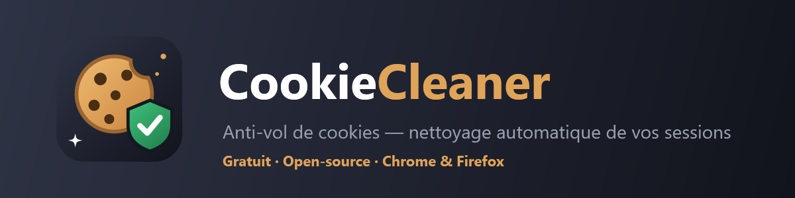

<div align="center">



**Limitez l'impact du vol de cookies. Automatiquement.**

Nettoie les cookies et données de session des sites de votre choix, à intervalle régulier —
pour qu'un cookie volé par un malware devienne inutilisable en quelques heures au lieu de plusieurs semaines.

[](LICENSE)


**Chrome** · **Edge** · **Brave** · **Opera** · **Firefox**

</div>

---

## 🎯 Pourquoi ?

Les malwares *infostealers* (RedLine, Lumma, Raccoon…) volent les cookies de votre navigateur et permettent à un attaquant de **se connecter à vos comptes sans mot de passe — et sans déclencher la 2FA**, puisque la session est déjà authentifiée. Discord, Gmail, Steam, réseaux sociaux : tout y passe.

Un cookie volé n'est utile que **tant que la session est valide**. CookieCleaner purge régulièrement les cookies (et les tokens du `localStorage`, ce qui couvre le cas Discord) des sites sensibles de votre choix. Résultat : la fenêtre d'exploitation d'un vol passe de plusieurs semaines à quelques heures.

> ⚠️ **Soyons honnêtes** : CookieCleaner **réduit** le risque, il ne l'annule pas. Si un malware est actif sur votre machine, il peut re-voler vos cookies à la prochaine connexion. Cet outil est un complément à un système sain, un antivirus et la 2FA — pas un remplacement. En cas d'infection avérée : nettoyez la machine, changez vos mots de passe **depuis un autre appareil**, et révoquez toutes les sessions.

## ✨ Fonctionnalités

- 🧹 **Nettoyage automatique** des cookies toutes les 30 min à 24 h (ou au démarrage du navigateur)
- 🎯 **Deux modes** : liste de sites choisis, ou « tout nettoyer sauf ma liste blanche »
- ⚡ **Presets en un clic** : Discord, Google, Steam, PayPal, Microsoft, réseaux sociaux…
- 🔐 **Purge du `localStorage` / IndexedDB** — là où vivent les tokens type Discord, que les nettoyeurs de cookies classiques oublient
- 🔗 **Liens de révocation** : accès direct aux pages « appareils connectés » officielles pour tuer les sessions côté serveur
- 🕵️ **Vérification de fuites** : e-mail via [Have I Been Pwned](https://haveibeenpwned.com), mot de passe via l'API anonyme *Pwned Passwords* (k-anonymity — le mot de passe ne quitte jamais votre appareil)
- 📋 **Journal** des nettoyages
- 🌍 Français + English
- 🆓 **Gratuit pour toujours, open-source, zéro serveur, zéro télémétrie** — tout reste sur votre machine

## 📦 Installation

### Chrome / Edge / Brave / Opera

*En attendant la publication sur le Chrome Web Store :*

1. Téléchargez le ZIP `chromium` depuis les [Releases](../../releases) (ou clonez ce repo)
2. Décompressez-le
3. Ouvrez `chrome://extensions` (ou `edge://extensions`, `opera://extensions`)
4. Activez le **Mode développeur** (en haut à droite)
5. Cliquez **« Charger l'extension non empaquetée »** et sélectionnez le dossier `extension/`

### Firefox

Firefox exige des extensions signées par Mozilla. Téléchargez le fichier `.xpi` signé depuis les [Releases](../../releases) et ouvrez-le avec Firefox — c'est tout.

> ℹ️ Sur Firefox, pensez à accorder la permission « Accéder à vos données pour tous les sites » dans les paramètres de l'extension, sinon le nettoyage ne verra pas tous les cookies.

## 🚀 Utilisation

1. Cliquez sur l'icône 🍪 puis **⚙️ Options**
2. Ajoutez vos sites sensibles (ou utilisez les presets)
3. Choisissez la fréquence de nettoyage
4. C'est tout — le bouton **« Nettoyer maintenant »** du popup est là pour les nettoyages immédiats

> 💡 À chaque nettoyage vous êtes **déconnecté** des sites concernés : c'est le principe. Choisissez une fréquence adaptée à votre usage (6 h est un bon compromis).

## 🔒 Confidentialité

- **Aucune donnée ne quitte votre appareil.** Pas de serveur, pas de compte, pas de statistiques.
- Les seules requêtes réseau sortantes sont celles que **vous** déclenchez dans la section « fuites » (vers haveibeenpwned.com / api.pwnedpasswords.com).
- La vérification de mot de passe utilise le k-anonymity : seuls les 5 premiers caractères du hash SHA-1 sont envoyés.
- Le code est volontairement **sans dépendance et sans build** : tout est lisible et auditable dans [`extension/`](extension/).

## 🛠️ Développement

```
extension/
├── manifest.json       # MV3, compatible Chromium + Firefox
├── background.js       # Service worker : alarmes + logique de nettoyage
├── popup/              # Popup (état, nettoyage immédiat)
├── options/            # Configuration complète
├── common/             # Style + i18n partagés
└── _locales/           # fr + en
```

Construire les ZIP de distribution :

```powershell
powershell -File scripts/build.ps1
```

## 🗺️ Feuille de route

- [x] Nettoyage périodique par liste de sites / tout-sauf-liste-blanche
- [x] Purge localStorage + IndexedDB
- [x] Vérification de fuites (HIBP)
- [ ] Publication Chrome Web Store + addons.mozilla.org
- [ ] Notification discrète après nettoyage (opt-in)
- [ ] Score d'hygiène (cookies tiers, sessions anciennes…)
- [ ] Guide « Que faire si je suis infecté ? »

Les contributions sont les bienvenues — ouvrez une issue ou une PR !

## 📄 Licence

[MIT](LICENSE) — utilisez, modifiez, partagez librement.
